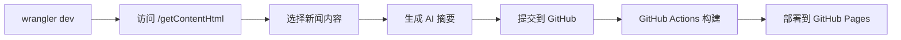

# 完整工作流程指南

## 🔄 工作流程概览



## 📝 详细步骤

### 1. 启动本地开发服务器

```bash
# 在项目根目录运行
wrangler dev
```

服务器将在 `http://localhost:8787` 启动。

### 2. 访问内容管理界面

打开浏览器访问：`http://localhost:8787/getContentHtml`

- 默认用户名：`root`
- 默认密码：`toor`

### 3. 选择新闻内容

1. 页面会显示来自各个数据源的最新内容
2. 勾选您想要包含在日报中的条目
3. 点击"提交"按钮

### 4. AI 处理和生成

系统会自动：
- 使用 AI 生成内容摘要
- 创建播客脚本
- 格式化为 Markdown 文档

### 5. 提交到 GitHub

点击"Commit to GitHub"按钮，内容会被推送到：
- 日报文件：`daily/YYYY-MM-DD.md`
- 播客脚本：`podcast/YYYY-MM-DD.md`

### 6. 本地预览（立即查看）

```bash
# 同步最新内容到 Hugo
bash scripts/sync-daily-to-hugo.sh

# 启动 Hugo 开发服务器
hugo server -D

# 访问 http://localhost:1313 查看
```

### 7. 自动部署（GitHub Actions）

推送到 GitHub 后，Actions 会自动：
1. 运行同步脚本
2. 构建 Hugo 站点
3. 部署到 GitHub Pages

## 🔧 配置说明

### 修改数据源

编辑 `wrangler.toml` 中的配置：

```toml
# Folo 数据源配置
FOLLOW_LIST_IDS = "news:123456789,project:987654321"
FOLLOW_COOKIE = "your_folo_cookie"

# GitHub 仓库配置
GITHUB_REPO_OWNER = "your_username"
GITHUB_REPO_NAME = "your_repo_name"
```

### 修改 AI 模型

```toml
# 使用 Google Gemini
USE_GEMINI = "true"
GEMINI_API_KEY = "your_api_key"

# 或使用 OpenAI 兼容模型
USE_GEMINI = "false"
OPENAI_API_KEY = "your_api_key"
OPENAI_API_URL = "https://api.openai.com/v1/chat/completions"
```

## 📁 文件组织

```
CloudFlare-AI-Insight-Daily/
├── daily/                    # 原始日报文件
│   └── 2025-01-16.md
├── content/daily/           # Hugo 格式化后的文件
│   └── 2025-01-16.md       # (包含 front matter)
├── public/                  # Hugo 构建输出
└── scripts/
    └── sync-daily-to-hugo.sh  # 同步脚本
```

## 🚀 快速命令

```bash
# 开发模式
wrangler dev

# 同步内容并预览
bash scripts/sync-daily-to-hugo.sh && hugo server -D

# 构建生产版本
hugo --minify

# 查看构建结果
open public/index.html
```

## ❓ 常见问题

### Q: 为什么本地看不到新生成的内容？

A: 生成内容后需要运行同步脚本：
```bash
bash scripts/sync-daily-to-hugo.sh
```

### Q: 如何修改站点域名？

A: 编辑 `hugo.toml`:
```toml
baseURL = 'https://your-domain.com/'
```

### Q: 如何添加新的数据源？

A: 参考 `src/dataSources/` 目录下的示例，创建新的数据源文件。

## 📊 工作流程图

```
┌─────────────────┐     ┌─────────────────┐     ┌─────────────────┐
│ CloudFlare      │────▶│ GitHub          │────▶│ GitHub Pages    │
│ Worker          │     │ Repository      │     │ (Hugo Site)     │
└─────────────────┘     └─────────────────┘     └─────────────────┘
       │                         │                         │
       │                         │                         │
       ▼                         ▼                         ▼
  生成日报内容              存储 Markdown            公开访问网站
                              文件
```

## 🔐 安全提醒

1. 不要提交包含敏感信息的 `wrangler.toml`
2. 使用环境变量或 GitHub Secrets 管理 API 密钥
3. 定期更新 GitHub Token